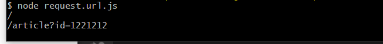

# 一、http.IncomingMessage
它的实例我们简称msg。这个实例的产生是被动的，可以由5种场景产生。

```nodejs
//这里的request就是msg对象
var server = http.createServer(function(request,response){ ... })

var server = http.createServer();
server.on("request",function(request,response){ ... })

// response 是msg对象  
var request = http.request(options, function(response) { ... })

var request = http.request(options);
request.on("response",function(response){ ... })

var request = http.get(options,function(response){})
```
msg并不一定代表请求对象，有时候也代表响应对象。msg可以理解为另一端socket发送来（或返回来）的数据，所以http.IncomingMessage是stream.Readable的子类，也就是只读的。

# 二、事件

# 2.1 'data'事件
当接收到数据时会产生这个事件，事件监听器会接收到数据。注意，如果不对这个事件添加监听器，那么数据会丢失。
```
incomingMessage.on('data',function(chunk){ ... });
```
chunk 是个数据片段，Buffer类型。
# 2.2 'end' 事件
如果在这个之后不会再产生数据了，那么就会发出这个事件。这个事件只发生一次。

```
incomingMessage.on('end',function(){ ... })
```
# 2.3 'close' 事件
这个事件的产生是当服务器端response.end() 调用之前客户端关闭造成的。看如下代码：
```
var http = require("http");
var server = http.createServer();
server.on("request",function(req,res){

    req.on("close",function(){
        console.log("close")
    })
    res.write("hello!");
    // res.end();
})
server.listen(8080);
```
这里的res.end() 不会被调用，当浏览器访问服务器，然后关闭浏览器，这时req就会发出close事件

# 三、incomingMessage对象的属性信息(IncomingMessage Methods and Properties)
|  对象的属性信息 |解释   |
|---|---|
|  destroy() |   |
|  headers |  Returns a key-value pair object containing header names and values |
|  httpVersion |  Returns the HTTP version sent by the client |
|  method|  Returns the request method |
| rawHeaders |  Returns an array of the request headers |
|  rawTrailers |  Returns an array of the raw request trailer keys and values |
|  setTimeout() |  Calls a specified function after a specified number of milliseconds|
|  statusCode |  Returns the HTTP response status code|
| socket	 |  Returns the Socket object for the connection|
| trailers	 |  Returns an object containing the trailers|
| url	 |  RReturns the request URL string|


## 3.1 message.headers 得到头部信息
下面的例子将获得一个浏览器发送来的请求的头部信息，然后进行详细分析。看代码：
```
// 服务器
var http = require("http");
var server = http.createServer();
server.on("request",function(req,res){
   console.log(req.headers)
})
server.listen(8080)
```
然后通过浏览器访问，会得到下面的信息，当然不同浏览器的信息稍有不同。

```
{ 
  host: 'localhost:8080',
  connection: 'keep-alive',
  accept: 'text/html,application/xhtml+xml,application/xml;q=0.9,*/*;q=0.8',
  'user-agent': 'Mozilla/5.0 (Windows NT 6.1) AppleWebKit/537.31 (KHTML, like Gecko) Chrome/26.0.141
0.43 Safari/537.31',
  'accept-encoding': 'gzip,deflate,sdch',
  'accept-language': 'zh-CN,zh;q=0.8',
  'accept-charset': 'GBK,utf-8;q=0.7,*;q=0.3',
  cookie: 'connect.sid=s%3AknJhNxKEK7nxXiYIsNfY%2BINl.%2B6HPsMaN6rEj9Hlm0e6CKp8lc6md2dHA9lo0xJs2szM'
}
```

下面对这些信息进行详细说明。

- host , 客户端指定自己想访问的WEB服务器的域名/IP 地址和端口号。

- connection , 有两个值close（告诉WEB服务器或者代理服务器，在完成本次请求的响应后，断开连接，不要等待本次连接的后续请求了）。keepalive（告诉WEB服务器或者代理服务器，在完成本次请求的响应后，保持连接，等待本次连接的后续请求）。

- accept, 告诉WEB服务器自己接受什么介质类型，/ 表示任何类型，type/* 表示该类型下的所有子类型，type/sub-type。

- user-agent, 浏览器表明自己的身份（是哪种浏览器）。

- accept-encoding , 浏览器申明自己接收的编码方法，通常指定压缩方法，是否支持压缩，支持什么压缩方法  （gzip，deflate）

- accept-language , 浏览器申明自己接收的语言跟字符集的区别。

- accept-charset , 浏览器申明自己接收的字符集。

下面是查看服务器发回来的响应信息的代码。

```
// 客户端
var http = require("http");
var req = http.get("http://www.google.com/"
,function(res){
    console.log(res.headers)
})
```
下面对这些信息进行详细说明:

- Cache- Control指定请求和响应遵循的缓存机制。在请求消息或响应消息中设置 Cache-Control并不会修改另一个消息处理过程中的缓存处理过程。
  - 请求时的缓存指令包括no-cache、no-store、max-age、 max-stale、min-fresh、only-if-cached，
  - 响应消息中的指令包括public、private、no-cache、no- store、no-transform、must-revalidate、proxy-revalidate、max-age。
  - 各个消息中的指令含义如 下： 
    - Public指示响应可被任何缓存区缓存。
    - Private指示对于单个用户的整个或部分响应消息，不能被共享缓存处理。这允许服务器仅仅描述当用户的部分响应消息，此响应消息对于其他用户的请求无效。 
    - no-cache指示请求或响应消息不能缓存 
    - no-store用于防止重要的信息被无意的发布。在请求消息中发送将使得请求和响应消息都不使用缓存。
    - max-age指示客户机可以接收生存期不大于指定时间（以秒为单位）的响应。
    - min-fresh指示客户机可以接收响应时间小于当前时间加上指定时间的响应。
    - max-stale指示客户机可以接收超出超时期间的响应消息。如果指定max-stale消息的值，那么客户机可以接收超出超时期指定值之内的响应消息。 

- Location响应头用于重定向接收者到一个新URI地址。

- Content-Type实体头用于向接收方指示实体的介质类型。

- set-cookie设置和页面关联的Cookie。

- expires 指定应该在什么时候认为文档已经过期，从而不再缓存它。

- server 服务器名字。

- content-length  表示内容长度。

- x-xss-protection  XSS筛选器,主要用于防御反射型跨站攻击，网站一般都会设置为 0 。

- x-frame-options 可用于指示是否应该允许浏览器呈现在一个页面FRAME 或 IFRAME 中。 以确保网站内容是不是嵌入到其它网站。使用X-Frame-Options 有两种可能的值：DENY ：该页无法显示在一个框架中。SAMEORIGHT ：页面只能显示在页面本网站的框架中。


## 3.2 message.httpVersion
http版本 1.1或1.0，基本都是1.1了。

## 3.3 message.method
http.IncomingMessage.method是内置http模块中的Incoming Message类的内置应用程序编程接口，用于获取请求方法的类型为字符串。

请求方法，这个只存在于请求对象中。 GET/POST
```
用法:

request.method
参数：此方法不接受任何参数作为参数。

返回值：此方法以字符串形式返回请求类型名称。
```

**request.method.js**
```
// Node.js program to demonstrate the   
// request.method Method  
    
// Importing http module  
var http = require('http');  
    
// Setting up PORT  
const PORT = process.env.PORT || 3000;  
    
// Creating http Server  
var httpServer = http.createServer( 
     function(request, response){  
  
  // Getting request method  
  // by using request.method method 
  const value = request.method; 
    
  // Display result on the console 
  response.end( "method:" + value, 'utf8', () => {  
      console.log("displaying the result...");  
  
      // Closing the server 
      httpServer.close(()=>{ 
          console.log("server is closed") 
      }) 
  });  
});  
    
// Listening to http Server  
httpServer.listen(PORT, () => {  
    console.log("Server is running at port 3000...");  
});
```

**执行命令：**
```
node request.method.js
```
控制台输出：
```
Server is running at port 3000...
displaying the result...
displaying the result...
server is closed
server is closed
```
浏览器输出：将本地主机地址http：//localhost：3000 /粘贴到浏览器的搜索栏中。

## 3.4 message.url 
 请求url，这只存在于请求对象中。看例子

 ```
// 服务器
var http = require("http");
var server = http.createServer();
server.on("request",function(req,res){
   console.log(req.url)
})
server.listen(8080)
 ```
 通过浏览器访问 http://localhost:8080/article?id=1221212 ， 控制台会打印


## 3.5 message.statusCode
响应状态代码，只存在于响应对象中。
例如 404 表示未找到资源。来做个例子。

```typescript
// 客户端
var http = require("http");
var req = http.get("http://www.google.com/idsddd.html"
,function(res){
    console.log(res.statusCode); // 404
})
```

## 3.6 message.socket 
这个是底层的net.Socket对象。（参看“node.js中的Socket对象”一节）

## 3.7 三个方法
要知道 IncommingMessage是stream.Readable子类。

关于 message.setEncoding([encoding]) / message.pause() / message.resume() 三个方法，这里就不介绍了，